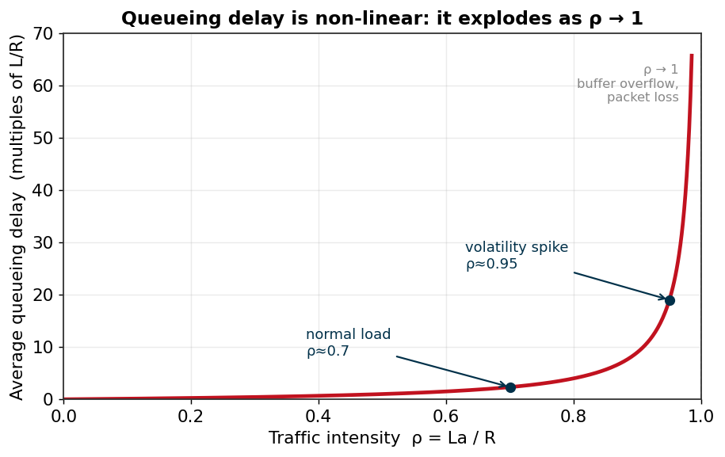
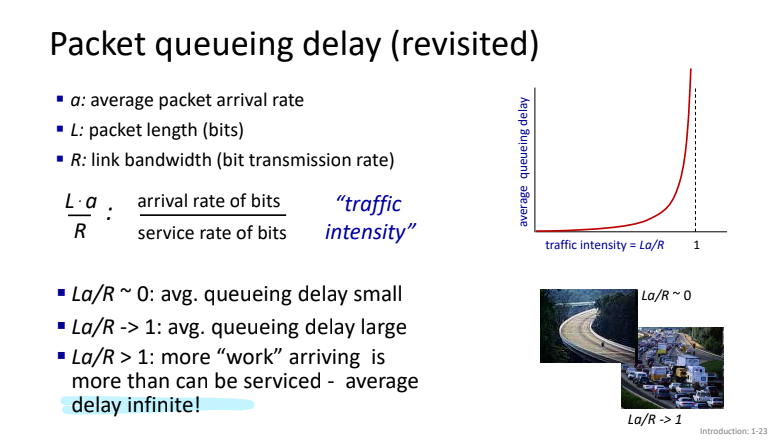
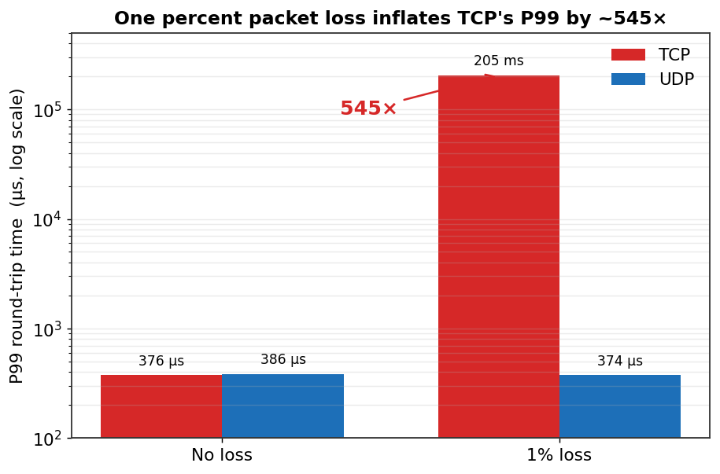

# Where the Microsecond Goes: Network Delay in High-Frequency Trading

**DCCS307 Computer Networks · Module 5 Case Study · Group 07**
**Boseok Kim (김보석) — Problem Lead**

Video: https://youtu.be/AZ7Uc7IFcnU

Contents — Problem: [§1](#1-why-microseconds-are-worth-money)–[§4](#4-the-hypothesis-i-handed-to-the-team) · Solutions: [§5](#5-what-the-team-built-on-top-summary) · Trade-offs: [§6](#6-the-trade-off-stated-plainly) · [Conclusion](#7-conclusion) · [My contribution](#8-my-contribution) · [References](#references)

---

This repository is my write-up for our Module 5 case study. Our group asked a
narrow question — *in high-frequency trading, where does a microsecond actually
go, and which part of that delay can software change?* — and answered it with a
mix of queueing theory, a measurement of our own, and a survey of what real
exchanges do.

I led the **problem definition**: framing the delay budget, deciding which of
the four textbook delays were worth chasing, and stating the hypothesis the rest
of the team then tested. The post below follows that arc. It is deepest on the
part I owned (the problem) and summarizes my teammates' work (the solution, the
measurement, the industry mapping) where it picks up from there.

**The one-line result:** under a 1% packet-loss rate, TCP's 99th-percentile
round-trip time in our test jumped from 376 µs to 205 ms — about **545×** —
while UDP barely moved. Everything below explains why that gap was predictable.

---

## 1. Why microseconds are worth money

High-frequency trading is algorithmic trading where decisions and orders are
made by machines on a microsecond timescale, with no human in the loop. By the
SEC's 2014 staff review it accounts for roughly half of US equity trading
volume, though estimates range from about 50% to 60% by year and there is no
single regulatory definition of "HFT." [1]

Speed matters because the market is winner-take-all. When a price moves, the
first order to reach the matching engine takes the trade; everyone slower gets
nothing. A widely-quoted industry estimate puts a 1-millisecond edge at about
$100 million a year for a major brokerage — a figure that traces to a 2007
*InformationWeek* piece and is best treated as folklore. [2] The rigorous
number came later: Aquilina, Budish and O'Neill measured the latency-arbitrage
"arms race" on London Stock Exchange message data and extrapolated the prize to
**on the order of $5 billion a year across global equity markets**, equivalent
to a ~0.5 basis-point tax on every trade. Removing it, they estimate, would cut
the cost of liquidity by about 17%. [3]

Winner-take-all means the average doesn't matter; the tail does. A system whose
mean round-trip is 100 µs but whose P99 is 200 ms is not "usually fast." It
loses the race one time in a hundred, and in a venue that trades thousands of
times a second, that is a continuous bleed. So the metric for this whole project
is not the mean. It is **P99 round-trip time under packet loss.**

> HFT is decided by the tail, not the average. That is the single design
> assumption everything else follows from.

## 2. The four delays, and which ones software can touch

Every packet pays four delays at each hop (Kurose & Ross, Ch. 1.4): [4]

```
d_total = d_proc + d_queue + d_trans + d_prop
```

| Delay | What it is | How you reduce it | Can software move it? |
|---|---|---|---|
| `d_prop` | signal travelling the medium, `d/s` | shorter distance: co-location, straight fibre, microwave | No — bounded by the speed of light |
| `d_trans` | pushing bits onto the link, `L/R` | faster NIC: 10/40/100 GbE | Effectively constant once the link is fast |
| `d_proc` | header checks, kernel work, decode | kernel bypass: DPDK, OpenOnload, RDMA | **Yes** |
| `d_queue` | waiting in the output buffer | protocol choice, QoS, buffer management | **Yes** |

The first two are not our problem. `d_prop` is a real-estate and physics
question — you solve it by moving your server next to the exchange, not by
writing code. `d_trans` for a 64-byte order on a 10 GbE link is about 50
nanoseconds; it is already solved by buying the right card.

That leaves `d_proc` and `d_queue`. These are the two delays a software decision
changes, and in a short-distance setting — inside a data centre, or a co-located
rack — they are also the two that dominate the budget. So the project
narrows to them, and `d_queue` in particular turns out to be the dangerous one.

## 3. Queueing delay: the non-linear one

Queueing delay is not just "another delay." It behaves differently from the
other three, and the difference is why it deserves an entire project.

Model the output port as an M/M/1 queue with traffic intensity
ρ = La/R (arrival bit-rate over service bit-rate). The mean queueing delay is:

```
E[w] = ρ / (1 − ρ) · (L / R)
```

That `1 − ρ` in the denominator is the problem. While ρ is small the delay is
negligible. As ρ approaches 1 the delay does not grow linearly — it goes to
infinity.



*`E[w]` in multiples of `L/R`, from `delay_simulator.py`. Going from a normal
load of ρ=0.7 to a volatility-spike load of ρ=0.95 takes `E[w]` from about 2.3
to 19 in units of `L/R` — roughly 8× — and the curve is still climbing.*

This is the same curve the course slides draw for `La/R → 1`:



*The same shape in the course slides: average queueing delay against `La/R`,
exploding as `La/R → 1` (Kurose & Ross, Ch. 1.4 [4]).*

Now layer the HFT context on top. The traffic is not steady. The moments worth
the most money — an FOMC decision, an earnings surprise, a geopolitical shock —
are exactly the moments when every algorithm submits at once, ρ jumps toward 1,
and queueing delay explodes. So the system is at its slowest exactly when speed
pays the most. Push ρ past 1 and the buffer overflows: packets are
dropped, and recovery becomes the transport layer's job — which is where TCP and
UDP stop being interchangeable.

### This is not hypothetical: 15 October 2014

On the morning of 15 October 2014 the US Treasury market — the deepest, most
liquid market in the world — did exactly this. The 10-year yield traded a
37-basis-point range intraday and fell 16 bp in six minutes (9:33–9:39 ET),
then retraced almost the entire move by 9:45, a round trip in a twelve-minute
window. Trading volume hit record highs, 6–10× its average during the event.
The five-agency Joint Staff Report concluded there was **no single cause** — no
fat finger, no headline. A market simply hit the steep part of the curve. [5]

> A microsecond-scale system degrading to milliseconds under load is not an edge
> case. It is the documented behaviour of the most liquid market on earth.

## 4. The hypothesis I handed to the team

If the controllable delay is `d_queue`, and the dangerous part of `d_queue` is
what happens after a packet is dropped, then **the transport protocol — how it
recovers from loss — is the real lever.** That gave us three hypotheses to test:

- **H1.** With no loss, TCP and UDP are nearly identical; the only difference is
  header overhead (20 vs 8 bytes), which is below the noise floor.
- **H2.** With 1% loss, TCP's P99 explodes into the hundreds of milliseconds
  because of its retransmission timeout, while UDP's normal-packet latency is
  unchanged.
- **H3.** For HFT, a *late* order is worth no more than a *lost* one — the
  market has already moved — so predictable latency (UDP) beats guaranteed
  delivery (TCP) for market data. The trade-off, not the raw speed, is the
  point.

The mechanism behind H2 is one line of kernel source. TCP cannot detect a lost
packet faster than its retransmission timeout, and Linux floors that timeout at
`TCP_RTO_MIN = HZ/5 = 200 ms` (`include/net/tcp.h`) — deliberately below RFC
6298's recommended one-second minimum, but still a thousand times our clean RTT
of ~180 µs. [6] One drop, and that order waits at least 200 ms — delivered, but
a thousand times too late to trade on.

A fuller derivation — the four delays in detail, the traffic-intensity model,
and the TCP/UDP comparison — is in
[`docs/problem-definition-deep-dive.md`](docs/problem-definition-deep-dive.md).

## 5. What the team built on top (summary)

The other three parts of the project took this problem and answered it. Briefly,
because the depth there is theirs, not mine:

**Solution — kernel bypass (Kim Jeongha).** Attacks `d_proc`. In a standard
stack a round trip crosses the kernel twice, paying 20–60 µs for safety and
generality that HFT does not want. DPDK (poll-mode, sub-microsecond, full
rewrite), OpenOnload (`LD_PRELOAD`, 1–3 µs, no code change, Solarflare-locked)
and RDMA (NIC writes remote memory, 1–2 µs, zero-copy) each skip more of the
kernel. The trade-off is the same each time: the more kernel you bypass, the
faster you go, and the more your code and hardware have to change.

**Validation — our own measurement (Son Hanju).** We tested H1 and H2 directly.
Two Docker containers, a client and a server, talk over a bridge — a real
interface, not loopback — with `tc netem` injecting reproducible loss on the
server's egress. 1,000 orders per run, same payload over TCP and UDP.



*Measured P99, log scale, from `delay_simulator.py`.*

| Metric | TCP (no loss) | UDP (no loss) | TCP (1% loss) | UDP (1% loss) |
|---|---|---|---|---|
| Mean | 188.6 µs | 178.0 µs | 2,306 µs | 177.9 µs |
| **P99** | **375.7 µs** | **386.1 µs** | **204,812 µs** | **374.5 µs** |
| Delivered | 1000/1000 | 1000/1000 | 1000/1000 | 992/1000 |

H1 holds: with no loss the gap is ~10 µs, and UDP's P99 is even slightly higher.
H2 holds hard: 1% loss pushes TCP's P99 from 376 µs to 205 ms — **545×** — while
UDP's P99 does not move. The 205 ms is the 200 ms `RTO_MIN` floor made visible.
UDP pays differently: 8 of 1000 orders are dropped, and the other 992 keep
baseline latency.

**Application — what exchanges actually do (Lee Junseo).** The industry does not
pick one protocol; it splits by purpose. Market data goes out over UDP multicast
— NASDAQ MoldUDP64, CME MDP 3.0, NYSE Pillar — because a lost tick is replaced
by the next one in microseconds. Order entry goes over TCP/FIX/OUCH, one client
at a time, where an order must arrive exactly once. CME even runs UDP multicast
with a *separate* TCP recovery channel used only when a subscriber detects a
sequence gap — UDP speed on the hot path, TCP reliability out-of-band. NASDAQ,
CME and NYSE arrived at the same split independently.

## 6. The trade-off, stated plainly

The trade-off is not "UDP is faster." With no loss they tie. The split only
appears under loss, and it is a split between two different costs, not a winner
and a loser:

| | TCP | UDP |
|---|---|---|
| On loss | retransmits — guarantees delivery | drops it — no recovery |
| Cost of that choice | the recovered packet is ≥200 ms late, and head-of-line blocking can stall packets behind it | the lost packet is gone for good |
| Reliability | 100% | ~99% |
| Tail latency | catastrophic under loss | flat |

For a file transfer, TCP's choice is obviously right. For HFT market data it is
obviously wrong, because of H3: a 200 ms-late price is worth nothing — the market
moved a thousand times while TCP waited — so paying 200 ms to guarantee a
worthless packet is a bad trade, and it drags the packets behind it down too.
UDP's "loss" is cheaper than TCP's "delay." That asymmetry only exists once ρ→1
forces a drop, and it is why exchanges put market data on UDP.

## 7. Conclusion

1. The HFT bottleneck a student can reason about is software, not physics:
   `d_proc` and `d_queue`, not `d_prop`. Inside a data centre they are most of
   the round trip.
2. The tail, not the mean, is what breaks — and `d_queue` builds the tail,
   because it is non-linear in ρ and HFT runs ρ→1 at exactly the wrong moments.
3. So protocol choice decides the system. TCP and UDP are equivalent until a
   drop, then diverge by 545× in our own measurement — and that asymmetry,
   not raw speed, is why real exchanges run UDP for market data and TCP for
   orders.

Theory predicted the number, our test produced it, and the exchanges were
already built around it.

## 8. My contribution

I was the **Problem Lead**. I owned Sections 1–4 above: the delay budget, the
argument that `d_proc`/`d_queue` are the only software-controllable delays, the
non-linearity of queueing delay as the reason the tail explodes, the 2014
Treasury event as evidence, and the H1–H3 hypotheses that defined what the rest
of the team measured. I opened the presentation (slides 1–7) and wrote the
problem-definition material this repository is built on. Sections 5–6 summarize
my teammates' parts, credited inline.

## Repository structure

```
.
├── README.md                              this tech blog
├── delay_simulator.py                     regenerates the two charts
├── figures/
│   ├── queueing-explosion.png             M/M/1 queueing delay vs ρ
│   ├── queueing-delay-textbook.png        course slide, La/R → 1
│   └── tcp-udp-p99-explosion.png          measured TCP vs UDP P99
├── docs/
│   └── problem-definition-deep-dive.md    full derivation (four delays, M/M/1, TCP/UDP)
└── CN_Module5_MidpointReport_Group07.pdf  group midpoint report
```

Reproduce the figures with:

```bash
python3 -m pip install matplotlib numpy
python3 delay_simulator.py
```

## References

[1] U.S. Securities and Exchange Commission, Staff of the Division of Trading
and Markets, *Equity Market Structure Literature Review, Part II: High Frequency
Trading*, March 18, 2014.

[2] R. Martin, "Wall Street's Quest To Process Data At The Speed Of Light,"
*InformationWeek*, April 21, 2007. (Origin of the often-repeated "$100 million
per millisecond" estimate, stated there without a source.)

[3] M. Aquilina, E. Budish, and P. O'Neill, "Quantifying the High-Frequency
Trading 'Arms Race'," *The Quarterly Journal of Economics*, vol. 137, no. 1,
pp. 493–564, 2022. doi:10.1093/qje/qjab032.

[4] J. F. Kurose and K. W. Ross, *Computer Networking: A Top-Down Approach*,
8th ed., Pearson, 2021, Ch. 1.4 (delay, loss, and throughput).

[5] U.S. Department of the Treasury, Board of Governors of the Federal Reserve
System, Federal Reserve Bank of New York, U.S. Securities and Exchange
Commission, and U.S. Commodity Futures Trading Commission, *Joint Staff Report:
The U.S. Treasury Market on October 15, 2014*, July 13, 2015.

[6] V. Paxson, M. Allman, J. Chu, and M. Sargent, *Computing TCP's
Retransmission Timer*, RFC 6298, IETF, June 2011. (Linux floors the RTO at
`TCP_RTO_MIN = HZ/5 = 200 ms` in `include/net/tcp.h`, below the RFC's
recommended 1-second minimum.)

---

*Group 07 — Boseok Kim (Problem), Jeongha Kim (Solution), Hanju Son
(Validation), Junseo Lee (Application). DCCS307 Computer Networks, Module 5,
2026.*
